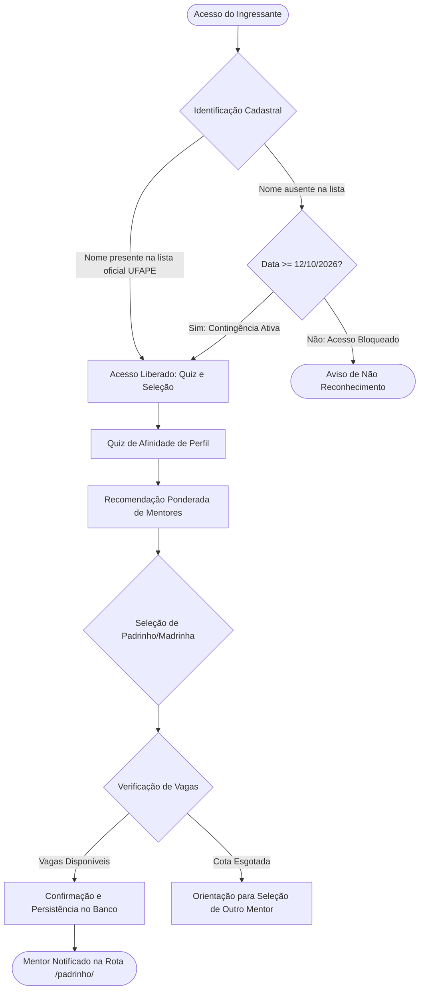

# Sistema de Apadrinhamento Acadêmico • Bacharelado em Administração (UFAPE)
### Plataforma Web de Integração, Acolhimento e Compatibilidade de Ingressantes 2026.2

---

## 1. Identificação Acadêmica e Registro de Autoria

* **Instituição de Ensino Superior:** Universidade Federal do Agreste de Pernambuco (UFAPE)
* **Idealização e Concepção do Projeto:** **Heloísa Pereira Barreto**
  * *Vínculo Acadêmico:* Discente ingressante em 2026.1 (atualmente no 2º semestre) do Bacharelado em Administração (UFAPE) e Madrinha Designada do Programa
* **Desenvolvimento e Responsabilidade Técnica:** **Kauã Vinicius dos Santos Barbosa**
  * *Vínculo Acadêmico:* Discente ingressante em 2025.1 do Bacharelado em Ciência da Computação (BCC / UFAPE)
  * *E-mail Institucional / Contato:* `kauavdsb.jobs@gmail.com`
  * *Perfil GitHub:* [github.com/KauaVDSB](https://github.com/KauaVDSB)
* **Curso Beneficiário:** Bacharelado em Administração (UFAPE)
* **Finalidade Institucional:** Projeto de Extensão Universitária e Desenvolvimento Tecnológico Voluntário para Comprovação de **Atividades Curriculares Complementares (ACC)**
* **Semestre Letivo de Execução:** 2026.2 (Outubro de 2026)

---

## 2. Contextualização e Justificativa Institucional

O ingresso no ensino superior público demanda iniciativas estruturadas de integração para fortalecer o sentimento de pertencimento e reduzir índices de evasão acadêmica nos períodos iniciais. O programa de apadrinhamento do Bacharelado em Administração da UFAPE estabelece uma ponte colaborativa entre discentes veteranos (mentores) e calouros (ingressantes do semestre 2026.2).

Para assegurar eficiência, sigilo de dados e confiabilidade no processo, este sistema substitui formulários manuais e planilhas descentralizadas por uma aplicação web com as seguintes premissas técnicas:
1. **Validação Nominal de Ingressantes:** Verificação prévia contra a listagem oficial de aprovados da UFAPE (2026.2), com mecanismo temporário de contingência para evitar exclusões;
2. **Algoritmo de Compatibilidade (Quiz de Perfil):** Cruzamento de afinidade acadêmica, metodologias de estudo e interesses extracurriculares entre calouros e veteranos;
3. **Privacidade e Proteção de Dados (LGPD):** Controle de acesso granular baseado em papéis (RBAC) com políticas em nível de linha (*Row Level Security* - RLS no Supabase), assegurando que veteranos tenham visibilidade exclusivamente sobre seus próprios afilhados;
4. **Governança de Vagas:** Parametrização rígida de cotas (5 afilhados por mentor, com cota especial definida de 4 vagas para uma madrinha específica);
5. **Arquitetura Mobile-First:** Interface fluida, sem sobrecarga de bibliotecas pesadas, desenvolvida com foco no consumo em dispositivos móveis.

---

## 3. Registro de Atividades Técnicas e Carga Horária (Comprovação ACC)

Tabela descritiva de esforço técnico e participação para posterior homologação de horas em Atividades Curriculares Complementares (ACC) junto ao Colegiado de Curso:

| Módulo / Atividade | Descrição Técnica da Atividade | Carga Horária |
| :--- | :--- | :---: |
| **I. Engenharia de Requisitos e Modelagem** | Elicitação de requisitos junto aos organizadores de Administração, modelagem relacional, definição de regras de negócio e governança RBAC. | *[A definir]* |
| **II. UI/UX Design e Prototipagem Mobile-First** | Arquitetura de informação, criação de componentes com a paleta aprovada (#0E2A47, #1E4C7C, #C9A227), avatares anônimos em monograma e testes de usabilidade. | *[A definir]* |
| **III. Desenvolvimento Frontend (Core e Quiz)** | Implementação em padrões web (HTML5 semântico, CSS3 e JavaScript ES6+), motor de compatibilidade ponderada e navegação adaptada. | *[A definir]* |
| **IV. Engenharia Backend e Segurança (Supabase/PostgreSQL)** | Estruturação do banco de dados, implementação de *Row Level Security* (RLS), integridade transacional de cotas e autenticação de usuários. | *[A definir]* |
| **V. Ingestão de Dados e Algoritmo de Validação** | Pipeline de saneamento, normalização ortográfica (Unicode/diacríticos) e conferência com a listagem oficial da UFAPE. | *[A definir]* |
| **VI. Painel de Gestão (Admin) e Exportação** | Implementação de dashboard administrativo analítico com métricas de preenchimento em tempo real e exportação de dados consolidados (Excel/CSV). | *[A definir]* |
| **VII. Homologação, Testes e Publicação CI/CD** | Testes de integração, auditoria de segurança dos acessos, otimização de mídias para carregamento rápido e configuração de deploy na Vercel. | *[A definir]* |
| **VIII. Participação Presencial no Evento de Acolhimento** | Apoio operacional, suporte técnico à plataforma e acompanhamento presencial dos ingressantes no evento oficial (14/10/2026). | **4h** |
| **TOTAL GERAL REGISTRADO** | **Carga horária total para convalidação de ACC** | *[A definir]* |

---

## 4. Arquitetura da Solução e Tecnologias

### 4.1. Camada de Apresentação (Frontend)
* **Padrões Web Nativos:** HTML5, CSS3 estruturado com variáveis customizadas e JavaScript moderno, assegurando carregamento veloz e baixo consumo de dados móveis;
* **Identidade Visual Sóbria:** Paleta institucional, tipografia Inter e representação vetorial anônima dos mentores (monogramas), preservando a privacidade visual inicial;
* **Otimização de Ativos:** Imagens, figurinhas e ilustrações compactadas para renderização ágil.

### 4.2. Camada de Dados e Segurança (Backend Supabase)
* **Banco Relacional:** PostgreSQL gerenciado via Supabase;
* **Políticas de Acesso (RLS):**
  * `calouros`: Leitura condicional para validação cadastral; inserção atômica;
  * `padrinhos`: Metadados públicos visíveis no catálogo; dados de contato e vínculos restritos via chave de autenticação;
  * `admin`: Perfil consolidado com privilégio de consulta geral e auditoria.

### 4.3. Regras de Negócio e Fluxo de Operação


1. **Normalização Cadastral:** O nome informado pelo calouro passa por tratamento de caracteres (remoção de acentos, pontuação, múltiplos espaços e unificação de caixa alta/baixa) antes da checagem na lista de aprovados;
2. **Parâmetro de Contingência Temporal (12/10/2026):** Provisoriamente programado para liberar o acesso a partir desta data, garantindo que inconsistências pontuais de grafia não impeçam o acolhimento antes do início das aulas (13/10/2026), passível de revisão pela comissão;
3. **Distribuição Parametrizada de Vagas:** Cada padrinho comporta até 5 afilhados, com exceção da madrinha pré-designada cuja cota máxima é fixada em 4 afilhados.

---

## 5. Estrutura de Permissões (RBAC)

| Papel (*Role*) | Rota de Acesso | Nível de Acesso e Permissões |
| :--- | :--- | :--- :--- |
| **Calouro (Público)** | `/` | Validação de ingresso, realização do quiz de perfil, visualização do catálogo anônimo de mentores e seleção de padrinho/madrinha. |
| **Padrinho / Madrinha** | `/padrinho/` | Autenticação individual via Supabase; visualização restrita e exclusiva dos seus próprios afilhados e contatos. |
| **Administrador / Coordenação** | `/admin/` | Visão analítica global da ocupação das cotas, relatórios em tempo real e exportação consolidada em planilha (.xlsx / .csv). |

---

## 6. Configuração e Publicação

### 6.1. Variáveis de Ambiente
Configurar no ambiente de execução ou arquivo `.env`:
```env
SUPABASE_URL=https://seu-projeto.supabase.co
SUPABASE_ANON_KEY=sua-chave-publica-anon
```

### 6.2. Publicação
O projeto é integrado à esteira de entrega contínua (CI/CD) na Vercel a partir do repositório oficial.

---

## 7. Direitos Autorais e Licença

Este software é licenciado sob os termos da **MIT License** por **Kauã Vinicius dos Santos Barbosa**, com cessão de uso integral e gratuita à Universidade Federal do Agreste de Pernambuco (UFAPE).

Consulte o arquivo [LICENSE](LICENSE) para termos integrais.
